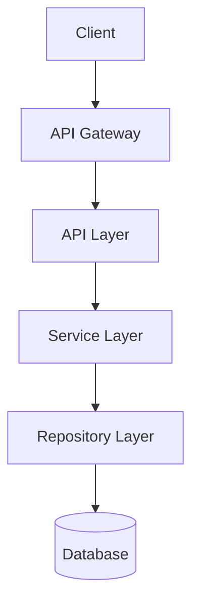

# System Architecture

## Architecture Overview

<!-- TODO: fill in architecture description -->



## Tech Stack

| Domain | Technology | Rationale |
|:------|:-----------|:----------|
| Frontend Framework | <!-- TODO --> | |
| Backend Framework | <!-- TODO --> | |
| Database | <!-- TODO --> | |
| Cache | <!-- TODO --> | |
| Message Queue | <!-- TODO --> | |

→ See `stacks/` presets for tech stack details

## Layered Architecture

### Frontend

```
src/
├── components/     # Shared components
├── features/       # Feature modules (by business domain)
├── hooks/          # Custom Hooks
├── layouts/        # Layout components
├── pages/          # Page components
├── services/       # API call layer
├── stores/         # State management
├── types/          # TypeScript type definitions
└── utils/          # Utility functions
```

### Backend

```
app/
├── api/            # Routing and request handling
├── service/        # Business logic
├── repository/     # Data access
├── schema/         # Data validation (Pydantic)
├── model/          # ORM models
├── core/           # Core config (DB connection, middleware, etc.)
└── utils/          # Utility functions
```

## Data Flow

<!-- TODO: describe the core data flow -->

## Deployment Architecture

<!-- TODO: describe the deployment topology -->

## Security Architecture

- Auth method: <!-- TODO -->
- Authorization model: <!-- TODO -->
- Data encryption: <!-- TODO -->
