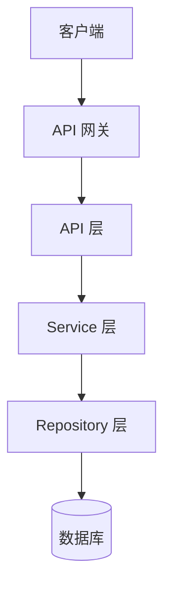

# 系统架构

## 架构概览

<!-- TODO: 填写架构描述 -->



## 技术选型

| 领域 | 技术方案 | 选型理由 |
|:-----|:---------|:---------|
| 前端框架 | <!-- TODO --> | |
| 后端框架 | <!-- TODO --> | |
| 数据库 | <!-- TODO --> | |
| 缓存 | <!-- TODO --> | |
| 消息队列 | <!-- TODO --> | |

→ 技术栈详情见 `stacks/` 预设文件

## 分层架构

### 前端

```
src/
├── components/     # 通用组件
├── features/       # 功能模块（按业务域划分）
├── hooks/          # 自定义 Hooks
├── layouts/        # 布局组件
├── pages/          # 页面组件
├── services/       # API 调用层
├── stores/         # 状态管理
├── types/          # TypeScript 类型定义
└── utils/          # 工具函数
```

### 后端

```
app/
├── api/            # 路由与请求处理
├── service/        # 业务逻辑
├── repository/     # 数据访问
├── schema/         # 数据校验（Pydantic）
├── model/          # ORM 模型
├── core/           # 核心配置（数据库连接、中间件等）
└── utils/          # 工具函数
```

## 数据流

<!-- TODO: 描述核心数据流 -->

## 部署架构

<!-- TODO: 描述部署拓扑 -->

## 安全架构

- 认证方式：<!-- TODO -->
- 授权模型：<!-- TODO -->
- 数据加密：<!-- TODO -->
