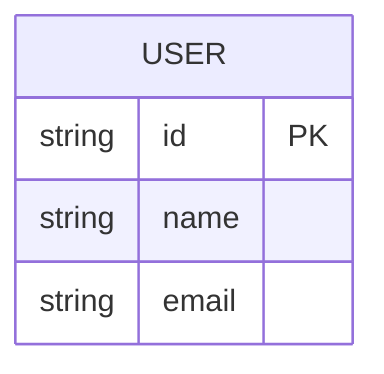

# Domain Model & Glossary

This file defines the project's core business concepts, domain terminology, and entity relationships. Agents should refer to this file when understanding requirements and writing code to keep terminology consistent.

## Core Domain

<!-- TODO: describe the business domain the project belongs to -->

## Glossary

| Term | English | Definition | Related Entities |
|:-----|:--------|:-----------|:-----------------|
| <!-- TODO --> | | | |

## Entity Relationships

## Business Rules

<!-- TODO: list core business rules and constraints -->

## Bounded Contexts

<!-- TODO: describe the bounded contexts in domain-driven design -->
