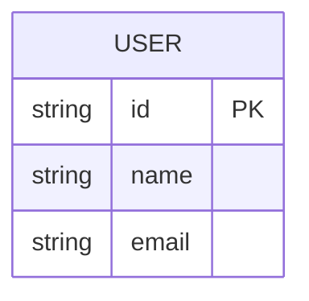

# 领域模型与术语表

本文件定义项目的核心业务概念、领域术语和实体关系。
Agent 在理解业务需求和编写代码时应参考本文件确保术语一致。

## 核心领域

<!-- TODO: 描述项目所属的业务领域 -->

## 术语表

| 术语 | 英文 | 定义 | 相关实体 |
|:-----|:-----|:-----|:---------|
| <!-- TODO --> | | | |

## 实体关系

## 业务规则

<!-- TODO: 列出核心业务规则和约束 -->

## 边界上下文

<!-- TODO: 描述领域驱动设计中的限界上下文 -->
